<p align="center">
  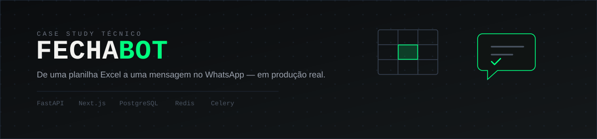
</p>

<p align="center">
  Como um "cientista de dados de bolso" para pequenos e médios negócios foi<br/>
  arquitetado, construído e endurecido em segurança — do zero até um pipeline<br/>
  validado ponta a ponta com WhatsApp real.
</p>

<p align="center">
  <a href="https://wellington-roveder.github.io/portifolio-Wellington-Roveder/">
    
  </a>
  <a href="https://www.linkedin.com/in/wellington-roveder-04637b37b/">
    
  </a>
  <a href="https://github.com/Wellington-Roveder">
    
  </a>
</p>

> **Nota:** este é um repositório de **case study** — documentação, decisões
> de arquitetura e demonstração em vídeo/print do produto funcionando. O
> código-fonte do FechaBot é privado; aqui você encontra o *raciocínio* por
> trás dele, não a implementação.

---

## 🎯 O problema

Grandes empresas têm equipes de dados e ferramentas como Power BI. Pequenos
e médios negócios — franquias, clínicas, distribuidoras, redes de varejo —
fecham o dia numa planilha Excel e não têm equipe técnica pra transformar
isso em informação útil, na hora certa, pra quem precisa decidir.

O FechaBot existe pra fechar essa lacuna.

## 🤖 O que o FechaBot faz

| Camada | O que entrega |
|---|---|
| **Fechamento automático** | Lê a planilha do negócio, aplica os filtros configurados e dispara o resumo formatado no WhatsApp, no horário certo |
| **Histórico inteligente** | Cada fechamento vira um registro persistido — banco de dados + planilha original preservada |
| **IA analista** | O gestor conversa em linguagem natural com os próprios dados, como se tivesse um cientista de dados pessoal |

<p align="center">
  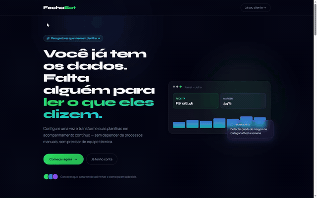
</p>

## 🛠️ Stack

<p align="left">
  
  
  
  
  
  
  
  
</p>

WhatsApp via Meta Cloud API. IA via Claude API (Anthropic). Testes com
pytest contra Postgres real, sem mocks de banco.

## 🔍 Destaques técnicos

Alguns pontos deste projeto que considero representativos do nível de
raciocínio envolvido — cada um detalhado em [`decisions/`](./decisions):

- **Modelo de sessão sem confiar só no JWT** — cookie `httpOnly` + CSRF
  double-submit + allowlist de sessão via Redis, pra que uma sessão possa
  ser revogada de verdade (não só client-side) antes da expiração natural
  do token.
- **Separação entre intenção do cliente e realidade externa** — quando a
  Meta reclassifica a categoria de um template WhatsApp automaticamente,
  o sistema rastreia `requested_category` (o que o cliente escolheu) e
  `effective_category` (o que está valendo de fato) como fontes de
  verdade distintas, com histórico completo.
- **Pipeline de envio assíncrono e resiliente** — fila via Celery, retry
  automático, e toda tentativa (sucesso ou falha) deixa rastro persistido
  — nunca descarta silenciosamente.
- **Segurança tratada como processo, não evento único** — múltiplos
  ciclos de revisão (ver [`security/`](./security)), cada um com achados
  documentados, correção e teste de verificação.
- **Isolamento multi-tenant como regra estrutural** — todo dado tem
  `tenant_id`; toda rota autenticada filtra por ele a partir do JWT,
  nunca de parâmetro de requisição.

## 📁 Como navegar este repositório

```
fechabot-case-study/
├── README.md            — você está aqui
├── banner.svg            — banner deste README
├── architecture/         — visão geral de arquitetura e diagramas
├── decisions/            — ADRs: decisões técnicas, alternativas e trade-offs
├── security/             — processo de revisão de segurança (achados → correção → por que importa)
├── roadmap/              — o que foi feito, o que falta, débitos técnicos abertos
└── media/
    ├── screenshots/      — telas do produto funcionando
    ├── diagrams/         — diagramas de arquitetura e fluxo
    └── videos/           — GIFs e vídeos curtos de fluxos completos
```

## 🎬 Demonstração

### Login e autenticação em duas etapas (MFA)

Sessão via cookie `httpOnly`, com verificação TOTP como segunda etapa —
detalhado na [ADR de modelo de sessão](./decisions).

<p align="center">
  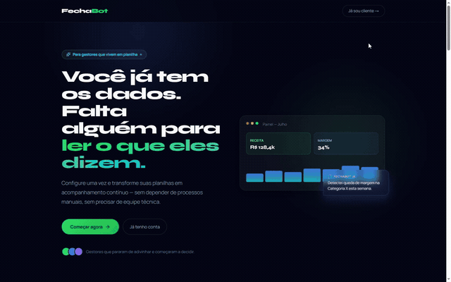
</p>

### Tour pelo dashboard

Chat com o FechaBot IA, tela de Segurança (2FA) e Configurações.

<p align="center">
  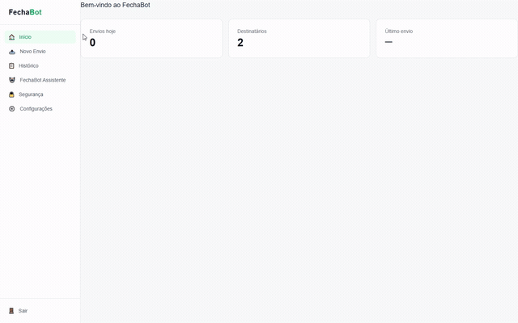
</p>

### Configuração de filtros

Upload da planilha de referência, detecção automática de colunas, e
condições compostas (AND / AND NOT) sobre os dados.

<p align="center">
  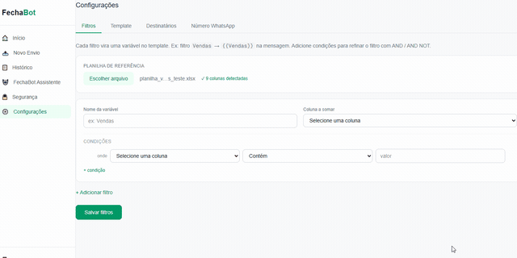
</p>

### Editor de template

Variáveis clicáveis (sistema, filtro, manual, lista), preview em tempo
real e valores de exemplo para validação antes do envio.

<p align="center">
  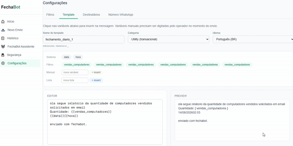
</p>

### Destinatários e número WhatsApp

<p align="center">
  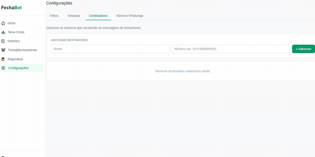
  <br/><br/>
  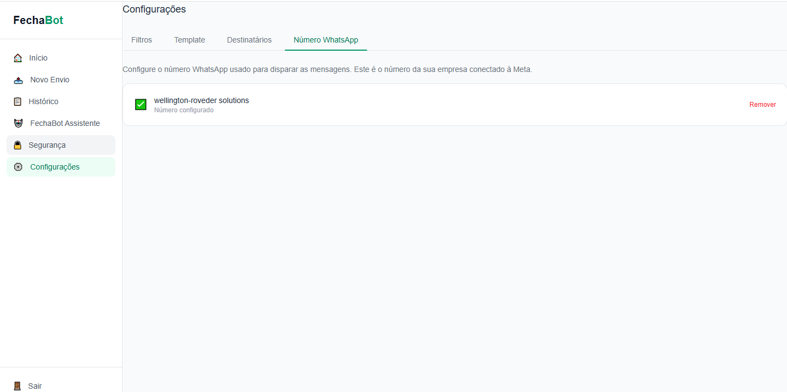
</p>

> Números de telefone e dados de destinatário nas capturas acima são
> valores de teste — nunca dado real de cliente (ver política de conteúdo
> deste repositório).

### Prova end-to-end: mensagem entregue no WhatsApp real

Template aprovado pela Meta, pipeline completo validado ponta a ponta —
da planilha até a mensagem chegando de fato no WhatsApp.

<p align="center">
  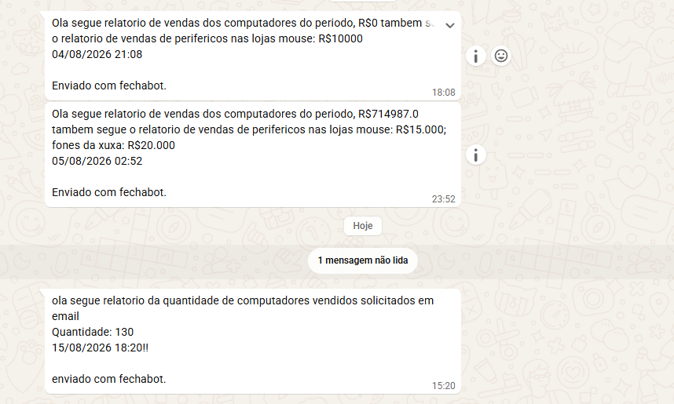
</p>

### Novo envio e histórico

Upload da planilha e confirmação de enfileiramento.

<p align="center">
  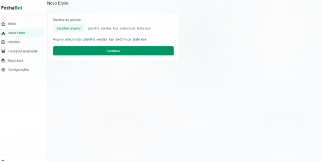
</p>

Histórico de envios — destinatários removidos após os testes; o
próprio produto reflete isso nativamente como "Destinatário removido".

<p align="center">
  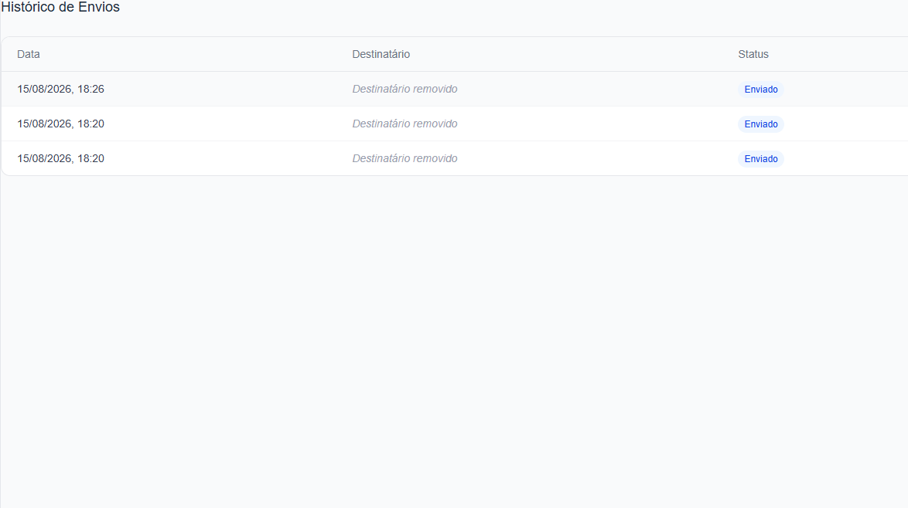
</p>

## 🗺️ Roadmap e maturidade

O produto evoluiu em sprints, cada um com escopo fechado e testado antes
de avançar. Status atual e débitos técnicos conhecidos (sanitizados) em
[`roadmap/`](./roadmap).

## 👨‍🎓 Sobre mim

Sou estudante de Ciência da Computação (Anhanguera SJC, 3º semestre) em
transição de carreira para desenvolvimento de software. Antes disso,
passei cerca de uma década em gestão operacional — bagagem que hoje se
traduz menos em "anos de experiência" e mais em hábitos que aplico
diariamente no código: comunicar decisões com clareza, priorizar sob
pressão, documentar o porquê das coisas e trabalhar bem debaixo de prazo.

O FechaBot é o projeto onde mais apliquei isso: cada sprint documentado,
cada decisão de segurança justificada, cada erro tratado como
aprendizado registrado — não escondido.

<p align="left">
  <a href="https://wellington-roveder.github.io/portifolio-Wellington-Roveder/" target="_blank">
    
  </a>
  <a href="https://www.linkedin.com/in/wellington-roveder-04637b37b/" target="_blank">
    
  </a>
  <a href="https://github.com/Wellington-Roveder" target="_blank">
    
  </a>
</p>
