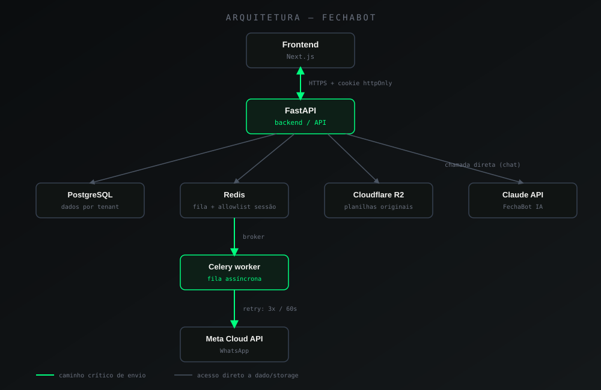

# Arquitetura

## Origem e motivação

O FechaBot não nasceu só como um produto — nasceu como um exercício
deliberado de aprender o ciclo completo de desenvolvimento de
aplicações web: como se desenha uma API, como ela se conecta a um
frontend, como as peças de infraestrutura (fila, cache, storage) se
encaixam nesse ciclo. A ideia desde o início foi aplicar, num projeto
real e com uso real, conceitos estudados em projetos anteriores — não
ficar só na teoria.

### Por que FastAPI, não Django

O projeto foi cogitado em Django no início. A troca para FastAPI foi
decidida por um motivo concreto: a **documentação automática via
Swagger/OpenAPI**. Em um projeto pensado para explorar o conceito de
API a fundo, ter o contrato de cada endpoint gerado automaticamente a
partir do próprio código — sem manter documentação separada
manualmente — pesou mais do que a maturidade e as baterias inclusas do
Django.

### Por que o frontend é um projeto separado

O frontend (Next.js) foi desenvolvido como projeto paralelo, não
integrado ao backend via templates. A razão principal foi prática:
**separar os dois permitia trabalhar em cada lado sem depender do
outro estar pronto** — o backend podia evoluir endpoints e o frontend
podia evoluir tela sem um bloquear o outro a cada mudança. Essa
separação também reforça o próprio ponto de aprendizado do projeto: o
backend existe como API de verdade, consumida por um cliente
independente — não como uma aplicação monolítica que apenas acontece
de expor JSON.

---

## Visão geral dos componentes

  

- **Frontend (Next.js):** interface do usuário. Nunca fala diretamente
  com Redis, Postgres, Meta ou Claude — toda comunicação passa pela
  API do backend.
- **Backend (FastAPI):** único ponto de entrada para regras de negócio,
  autenticação e autorização. Orquestra tudo o que acontece depois de
  uma requisição.
- **PostgreSQL:** fonte de verdade dos dados estruturados — tenants,
  usuários, filtros, templates, histórico de envios.
- **Redis:** usado para duas responsabilidades distintas — broker da
  fila Celery, e allowlist de sessão (quais sessões estão realmente
  ativas, além do que o JWT por si só afirma).
- **Celery:** processa tudo que é potencialmente lento ou depende de
  serviço externo — nenhuma chamada a um serviço de terceiro acontece
  de forma síncrona dentro do ciclo de requisição/resposta do backend.
- **Cloudflare R2:** armazena as planilhas originais enviadas pelo
  usuário, preservadas mesmo após o processamento.
- **Meta Cloud API / Claude API:** as duas integrações externas do
  sistema — WhatsApp para entrega de mensagem, Claude para o módulo de
  IA conversacional.

---

## Fluxo de dados: de uma planilha a uma mensagem no WhatsApp

Passo a passo do caminho mais importante do sistema — o que acontece
entre o usuário enviar um fechamento e a mensagem chegar de fato no
WhatsApp do destinatário:

1. **Upload.** O frontend envia a planilha para o backend via
   requisição autenticada (cookie httpOnly + CSRF).
2. **Leitura e validação.** O backend lê as colunas da planilha,
   detecta automaticamente quais variáveis do template são manuais
   (não vêm de filtro nem são de sistema), e persiste o arquivo
   original no R2 — antes de qualquer processamento, nunca depois.
3. **Aplicação dos filtros.** Os filtros configurados pelo usuário são
   aplicados sobre os dados da planilha, gerando os valores calculados
   que vão preencher o template.
4. **Resposta imediata ao usuário.** O backend não espera nenhuma
   chamada à Meta terminar — a requisição retorna assim que o
   fechamento é enfileirado, confirmando "mensagens enfileiradas".
5. **Enfileiramento no Celery.** Uma task é despachada por
   destinatário. Cada task tem retry automático (3 tentativas, 60s de
   intervalo) para lidar com falhas transitórias da Meta.
6. **Envio via Meta Cloud API.** O worker Celery faz a chamada real à
   API do WhatsApp. Sucesso ou falha, o resultado é persistido em
   `sends` — nenhuma tentativa é descartada silenciosamente.
7. **Histórico.** O envio aparece na tela de Histórico do usuário,
   consultável a qualquer momento — o retorno da etapa 4 não é a
   confirmação de entrega, é a confirmação de que o processo começou.

Esse fluxo é a espinha dorsal do produto — é também o fluxo documentado
com prova real (planilha → mensagem chegando no WhatsApp) na seção de
demonstração do [README principal](../README.md).

Versão expandida deste fluxo, incluindo casos de erro e retry, em
[`data-flow.md`](./data-flow.md).

---

## Decisões relacionadas

Duas decisões de arquitetura específicas deste fluxo têm ADR próprio,
com alternativas consideradas e trade-offs detalhados:

- [ADR 001 — Modelo de sessão](../decisions/001-modelo-sessao-cookie-csrf-redis.md)
- [ADR 003 — Envio sempre assíncrono via Celery](../decisions/003-envio-assincrono-celery.md)
