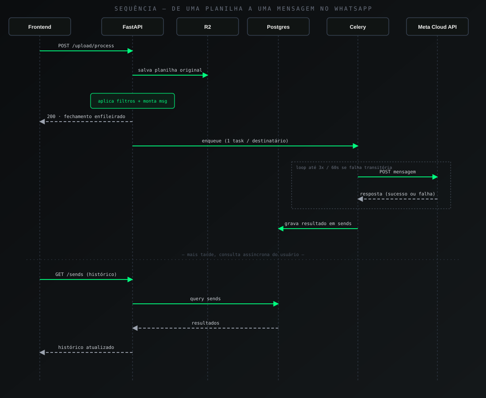

# Fluxo de dados: da planilha à mensagem no WhatsApp

Versão expandida do fluxo resumido em [`architecture/README.md`](./README.md) —
aqui o foco é também nos casos de erro e retry, não só no caminho feliz.

  

## Caminho feliz

1. **Upload.** Frontend envia a planilha via requisição autenticada
   (cookie httpOnly + CSRF). Backend valida tamanho e tipo de arquivo
   antes de processar qualquer conteúdo.
2. **Leitura de colunas.** Backend lê as colunas disponíveis na
   planilha e retorna para o frontend montar a tela de configuração de
   filtros.
3. **Persistência no storage.** A planilha original é enviada ao
   Cloudflare R2 **antes** de qualquer processamento — garantindo que o
   arquivo bruto sobrevive mesmo que uma etapa posterior falhe.
4. **Aplicação dos filtros.** Os filtros salvos pelo tenant são
   aplicados sobre os dados, gerando `{filter_name: valor}`. Campos
   manuais (detectados automaticamente por não corresponderem a nenhum
   filtro nem variável de sistema) são preenchidos pelo operador no
   momento do envio.
5. **Substituição no template.** As variáveis do template (`{{var}}`)
   são substituídas pelos valores calculados, manuais e de sistema
   (data, hora).
6. **Resposta imediata.** O endpoint retorna confirmando que o
   fechamento foi enfileirado — sem esperar nenhuma chamada à Meta.
   Ver [ADR 003](../decisions/003-envio-assincrono-celery.md) para o
   raciocínio completo por trás dessa escolha.
7. **Enfileiramento por destinatário.** Uma task Celery é despachada
   para cada destinatário do envio — não uma task só para todos.
8. **Chamada à Meta Cloud API.** O worker faz a chamada real de envio.
9. **Persistência do resultado.** Sucesso ou falha, o resultado vira um
   registro em `sends` — nunca é descartado silenciosamente.
10. **Consulta no Histórico.** O usuário acompanha o resultado real na
    tela de Histórico — a confirmação da etapa 6 é sobre o
    enfileiramento, não sobre a entrega de fato.

## Casos de erro e retry

| Cenário | Comportamento |
|---|---|
| Falha transitória na chamada à Meta (timeout, instabilidade momentânea) | Retry automático — 3 tentativas, intervalo de 60s entre elas |
| Todas as tentativas de retry se esgotam | Registro final em `sends` com status de falha — visível no Histórico, não descartado |
| Falha antes mesmo de qualquer chamada à Meta (ex: erro de validação interna) | Também gera registro em `sends` — corrigido na Sprint 10.5 depois que um bug real permitia que esse caso específico não deixasse rastro nenhum |
| Retry duplicando registro de falha | Corrigido na Sprint 10 — o registro de falha agora é gravado apenas na primeira tentativa, não a cada retry |
| Tenant sem número WhatsApp ativo configurado | O envio não é despachado — o sistema depende de exatamente 1 número ativo por tenant (regra de MVP) |
| Planilha com formato ou colunas inválidas | Rejeitada na etapa de leitura de colunas (passo 2), antes de qualquer processamento ou persistência de filtro |

## Por que cada etapa de falha vira registro

A regra de arquitetura por trás da coluna "Comportamento" acima não é
incidental — é deliberada: **toda tentativa de envio, sucesso ou
falha, deixa rastro**. Um sistema de fila com retry introduz uma
categoria própria de bug (visto na prática nos dois itens da tabela
marcados como "corrigido na Sprint 10 / 10.5") — descartar uma falha
silenciosamente parece inofensivo até o momento em que alguém precisa
entender por que uma mensagem nunca chegou, e não há registro nenhum
de que ela sequer foi tentada.

## Fluxos relacionados, fora do escopo deste documento

O chat da FechaBot IA (`POST /fechabotai/chat`) segue um caminho mais
simples — chamada direta e síncrona à Claude API dentro do ciclo de
requisição, sem passar pela fila Celery, já que não depende de um
serviço de mensageria de terceiro com a mesma instabilidade esperada
da Meta Cloud API. Esse fluxo está representado no diagrama de
componentes em [`architecture/README.md`](./README.md).
